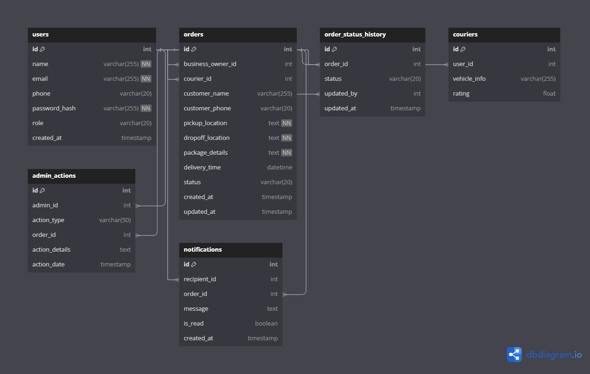

### Package Tracking System - Phased Features Breakdown

---

### **Phase 0: User Features**

#### 1. **User Registration Page** [feature #1]

- **Frontend:**
  - Create a form for user registration that collects:
    - Name
    - Email
    - Phone number
    - Password
- **Backend:**
  - **Endpoint**: `/api/register`
    - Handle registration requests.
    - Validate user input (e.g., required fields, password strength, valid email).
    - Store new user data securely in the database.
    - Send confirmation of successful registration.

#### 2. **User Login Page** [feature #2]

- **Frontend:**
  - Create a login form that collects:
    - Email
    - Password
- **Backend:**
  - **Endpoint**: `/api/login`
    - Validate user credentials.
    - Generate and return a token (e.g., JWT) upon successful authentication.
    - Store session data if necessary.

---

### **Phase 1: Order Management**

#### 3. **Create Order Page** [feature #3]

- **Frontend:**
  - Create a form to enter order details:
    - Pickup location
    - Drop-off location
    - Package details (e.g., size, weight, description)
    - Option to select preferred delivery time
- **Backend:**
  - **Endpoint**: `/api/orders/create`
    - Validate order data (e.g., valid locations, delivery time).
    - Save the order details in the database, linking it to the logged-in user.
    - Return an order confirmation with tracking details.

#### 4. **My Orders Page** [feature #5]

- **Frontend:**
  - Display a list of all orders placed by the user, showing:
    - Order ID
    - Status (e.g., pending, in transit, delivered)
    - Basic details (e.g., pickup/drop-off locations)
- **Backend:**
  - **Endpoint**: `/api/orders`
    - Retrieve all orders associated with the logged-in user.
    - Return order data including statuses and details.

#### 5. **Order Details Page** [feature #6]

- **Frontend:**
  - Show detailed information for a selected order, including:
    - Pickup and drop-off locations
    - Package details
    - Courier information (if assigned)
    - Option to cancel the order if it’s still pending
- **Backend:**
  - **Endpoint**: `/api/orders/:id`
    - Retrieve detailed information for a specific order using its ID.
    - Allow the user to cancel the order if it hasn’t been picked up yet.

---

### **Courier Features**

#### 6. **Assigned Orders Page** [feature #7]

- **Frontend:**
  - Display a list of all orders assigned to the courier with:
    - Order details (pickup/drop-off locations, package info)
    - Options to accept or decline the order
    - Status indicators for each order (e.g., pending, accepted)
- **Backend:**
  - **Endpoint**: `/api/couriers/orders`
    - Fetch all orders assigned to the logged-in courier by their ID.
    - Allow acceptance or declination of the order, updating the status accordingly.

#### 7. **Update Order Status** [feature #8]

- **Frontend:**
  - Provide couriers with the ability to update the order status:
    - Status options (e.g., picked up, in transit, delivered)
- **Backend:**
  - **Endpoint**: `/api/orders/:id/status`
    - Receive the new status from the courier.
    - Validate the status change and update the order in the database.
    - Notify the user about the status update (optional).

---

### **Admin Features**

#### 8. **Manage Orders Page** [feature #9]

- **Frontend:**
  - Display all orders in a table with:
    - Order details (customer, locations, courier info)
    - Buttons to update statuses or delete orders
- **Backend:**
  - **Endpoint**: `/api/admin/orders`
    - Retrieve all orders from the system.
    - Allow the admin to update statuses or delete orders as needed.

#### 9. **Assigned Orders to Courier** [feature #10]

- **Frontend:**
  - Show a list of orders with:
    - Courier assignment details
    - Option to reassign couriers if necessary
- **Backend:**
  - **Endpoint**: `/api/admin/orders/assign`
    - Fetch and manage courier assignments for specific orders.
    - Enable reassigning of couriers when needed.

---

### Database Schema Description

This section describes the database schema used in the package tracking system, including tables for users, orders, couriers, admin actions, and notifications, along with their relationships.

